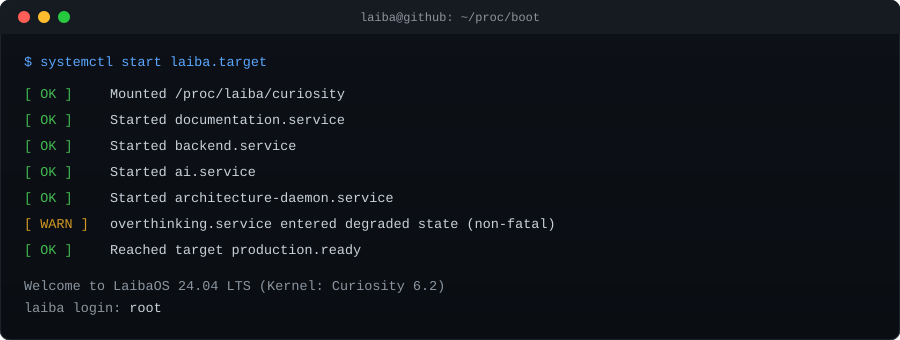
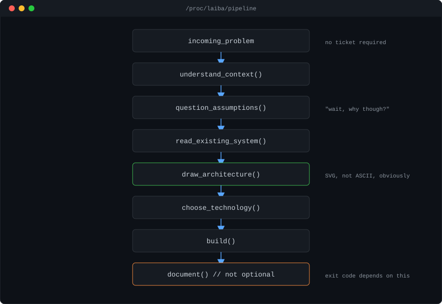
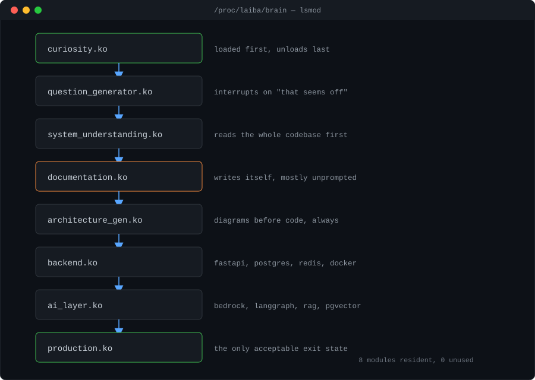

<div align="center">

</div>

<br/>

<div align="center">

</div>

<br/>

<div align="center">

</div>

---

```
$ man laiba
```

```
LAIBA(1)                    General Commands Manual                   LAIBA(1)

NAME
       laiba — backend and AI systems engineer

SYNOPSIS
       laiba [--backend] [--ai] [--distributed-systems] [--ships-docs-too]

DESCRIPTION
       Week one: too many questions. Week two: an architecture diagram
       nobody asked for is the thing the whole team points to in standup.

       Currently running three production services simultaneously.
       Maintains an open source WebSocket framework. Reads RFCs for fun.
       This has been flagged. No fix is scheduled.

OPTIONS
       --backend              fastapi · postgresql · redis · async python
       --ai                   rag · bedrock · langgraph · agentic workflows
       --distributed-systems  event-driven · multi-tenant · real-time
       --ships-docs-too       non-negotiable, cannot be disabled

EXIT STATUS
       0   problem found · system built · docs shipped · repeat

LAIBA(1)                    General Commands Manual                   LAIBA(1)
```

---

```
$ neofetch
```

<div align="center">

</div>

---

```
$ systemctl list-units --state=running
```

```
● delivero.service     white-label delivery platform        active (running)
● cadie.service        enterprise AI risk intelligence      active (running)
● lexertia.service     enterprise legal AI                  active (running)
```

<details>
<summary><code>→ delivero</code></summary>

Multi-tenant · 5 user roles · web + Android + iOS  
40+ REST APIs · 10+ Socket.IO events · full order lifecycle  
`fastapi · postgresql · redis · socket.io · docker`
</details>

<details>
<summary><code>→ cadie</code></summary>

RAG pipelines + multi-agent workflows on AWS Bedrock  
Aurora PostgreSQL + pgvector · ECS · SQS + EventBridge · Cognito  
`fastapi · aurora · pgvector · bedrock · ecs · sqs`
</details>

<details>
<summary><code>→ lexertia</code></summary>

Report generation · motion drafting · production maintenance  
`fastapi · cognito · real-time services`
</details>

---

```
$ cat /proc/laiba/pipeline
```

<div align="center">

</div>

---

```
$ lsmod
```

<div align="center">

</div>

---

```
$ apt-cache show socketspec
```

```
Package:     socketspec
License:     Apache-2.0
PyPI:        pypi.org/project/socketspec

             FastAPI-flavored WebSocket framework. Decorator routing,
             typed events, dependency injection, auth primitives, docs.
             Because no one should reinvent WebSocket auth a third time.
```

[](https://github.com/ByteCraftByLaiba/socketspec)
[](https://pypi.org/project/socketspec)
[](https://github.com/ByteCraftByLaiba/socketspec/blob/main/LICENSE)

---

```
$ ls projects/
```

```
smartml/          no-code AutoML — upload dataset, get model + SHAP report
                  fastapi · next.js · postgresql · aws · xgboost
                  → smartml.tech

doctor-agent/     LangGraph agentic AI for scheduling + triage + RAG Q&A
                  >90% intent accuracy · 8 interaction flows
                  fastapi · langgraph · openai · faiss
```

---

```
$ cat /var/log/known_bugs.log
```

```
  ✗  documentation.service starts before the ticket is filed
  ✗  produces architecture diagrams for two-line changes
  ✗  40-minute naming discussions. considers them time well spent.
  ✗  becomes the team wiki without applying for the role
  ✗  reads RFCs for fun — no fix scheduled

resolution: won't fix
```

---

```
$ journalctl --grep=SUCCESS
```

```
[SUCCESS]  gold medal · rank #1 · cgpa 4.00/4.00
[SUCCESS]  google asia-pacific generation scholar 2024 · top 3 women, apac
[SUCCESS]  employee of the quarter · ibtidah solutions
[SUCCESS]  runner-up · techathon 2025 · ucp olympiad 2024
[SUCCESS]  production deployed · docs in the same PR
```

---

```
$ grafana --dashboard=stats
```

<div align="center">


&nbsp;


<br/>


</div>

---

```
$ shutdown now
```

```
Stopping backend.service............     [ done ]
Stopping ai.service.................     [ done ]
Saving architecture diagrams........     [ done ]
Saving documentation................     [ done ] (it was already saved)

Broadcast: System going down NOW

   I don't chase technologies.
   I chase problems.
   The technologies usually follow.
```

<div align="center">

[](mailto:its.laiba.shahab@gmail.com)
[](https://linkedin.com/in/laiba-shahab)
[](https://github.com/ByteCraftByLaiba)

<sub>LAIBA(1) &nbsp;&nbsp;&nbsp;&nbsp;&nbsp;&nbsp;&nbsp;&nbsp;&nbsp;&nbsp;&nbsp;&nbsp;&nbsp;&nbsp; General Commands Manual &nbsp;&nbsp;&nbsp;&nbsp;&nbsp;&nbsp;&nbsp;&nbsp;&nbsp;&nbsp;&nbsp;&nbsp;&nbsp;&nbsp; LAIBA(1)</sub>

</div>
