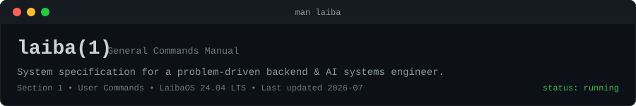
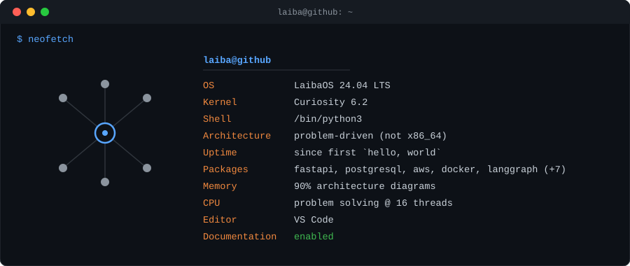

<div align="center">



<br/>


</div>

---

```bash
guest@laiba:~$ whoami
```

```text
Backend & AI Systems Engineer
Gold Medalist, CS  ·  CGPA 4.00/4.00  ·  Google APAC Scholar '24
```

---

```bash
guest@laiba:~$ neofetch
```

<div align="center">



</div>

---

```bash
guest@laiba:~$ htop
```

```text
CPU (problem solving)     ██████████████████████░░░░░░  72%
Coffee                    █████████████████████████████ 100%
Documentation             █████████████████████████████ 100%
Architecture              █████████████████████████████ 100%
Meetings                  ███░░░░░░░░░░░░░░░░░░░░░░░░░░░   9%
```

---

```bash
guest@laiba:~$ systemctl --state=running
```

```text
  UNIT                          STATUS    DESCRIPTION
● delivery-platform.service     active    White-label logistics backend
● enterprise-ai.service         active    Multi-tenant AI risk platform
● legal-ai.service              active    Enterprise legal AI backend

  3 loaded · 0 failed
```

---

```bash
guest@laiba:~$ tree ~/brain -L 2
```

```text
brain/
├── architecture/   → diagrams, ERDs, API design
├── backend/        → fastapi, async-python, auth, websockets
├── ai/             → rag, langgraph, bedrock, vector-search
├── cloud/          → aws, docker, ecs, eventbridge, sqs
├── databases/      → postgres, redis, mongodb, pgvector
└── curiosity/      → unlimited
```

---

```bash
guest@laiba:~$ cat ~/achievements.log
```

```text
[✔] Gold Medalist — Department of Computer Science
[✔] Rank #1 — CGPA 4.00 / 4.00
[✔] Google APAC Generation Scholar 2024
[✔] Employee of the Quarter — Ibtidah Solutions
[✔] Production systems deployed — still running
```

---

```bash
guest@laiba:~$ skills --grouped
```

<div align="center">

**Languages** <br/>


**Backend** <br/>


**AI** <br/>


**Cloud** <br/>


**Database** <br/>


**Frontend** *(enough to be dangerous)* <br/>


</div>

---

```bash
guest@laiba:~$ ./contact.sh
```

<div align="center">

[](mailto:its.laiba.shahab@gmail.com)
[](https://linkedin.com/in/laiba-shahab)
[](https://github.com/ByteCraftByLaiba)

</div>

---

```bash
guest@laiba:~$ stats --live
```

<div align="center">


<br/><br/>


</div>

---

```bash
guest@laiba:~$ shutdown -h now
```

```text
Stopping curiosity.service...   failed (unstoppable)
Connection to laiba.dev closed.
```

<div align="center">

⭐ **Thanks for stopping by — feel free to explore the repos.**

</div>
